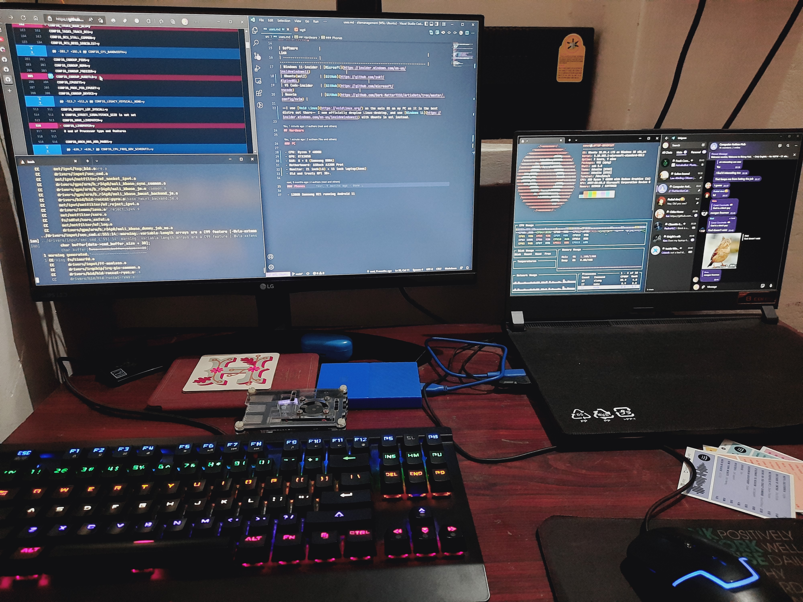

<h1 style="display: none;"> USES </h1>

## Editor + Terminal

I use the `windows-terminal` that ships with Windows 11-insider preview with `zsh` and powershell-7. The editor I use depends on what code I am working with:

- Web, Python: VS Code
- Android: VS Code
- Flutter: VS Code
- Kernel: VS Code
- Docs: Neovim

I just use [nvim](https://neovim.io/) for quick editing on servers(better than emacs). Fight me.

### OS & tooling

| Software            | Link                                                                            |
| ------------------- | ------------------------------------------------------------------------------- |
| Windows 11-insiders | [Microsoft](https://insider.windows.com/en-us/insidewindows11)                  |
| VoidWSL             | [GitHub](https://github.com/Dark-Matter7232/VoidWSL)                            |
| VS Code-insiders    | [GitHub](https://github.com/microsoft/vscode)                                   |
| Neovim              | [GitHub](https://github.com/Dark-Matter7232/ArtixDots/tree/master/.config/nvim) |

~~I use [Void Linux](https://voidlinux.org/) as the main OS on my PC as it is the best distro out there~~ I now officially despise Linux desktop and use [Windows 11](https://insider.windows.com/en-us/insidewindows11) with [VoidWSL](https://github.com/Dark-Matter7232/VoidWSL) instead.

## My workspace

### Hardware

- CPU: Ryzen 7 4800H
- GPU: RTX3050
- RAM: 8 + 8 (Samsung DDR4)
- Monitor: 21 inch (LG) + 15 inch laptop (Asus)
- Mouse: El Cheapo hp mouse.
- Keyboard: Off-brand mech keeb.
- Old and trusty RPI 3B+.

### Phone

- 128GB Moto G40 Fusion running Android 11
